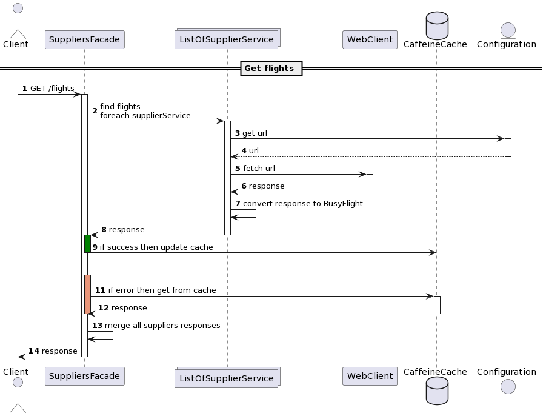

# Busy Flights Api

## Introduction
The purpose of this document is to describe the behaviour and the design of busy-flights-api.
The requirements are described in [requirements.md](./requirements.md).

## Assumptions
During the development, a few assumptions have been made that are not covered by the requirements:
- All the request objects are supposed to be consumed as query parameters, not as request bodies by the apis
- All the fields in `BusyFlightsRequest` are all required, except for `returnDate` which is optional
- `ToughGetRequest.discount` is a percentage in the format 0 to 100 (0% to 100%)
- CrazyAir and ToughJet responses are a list of `CrazyAirResponse` and `ToughJetResponse` since no other data structure is defined for it in the requirement. Even if it doesn't follow best practises, I left it like this because I cannot have control on the structure of external services
- BusyFlights response is instead `BusyFlightsResponseList`, which is a wrapper of `BusyFlightsResponse` following best practises. This allows to add new parameters in the response in the future (such as paging), maintaining backward compatibility

## Changes to initial codebase
- I upgraded the java version from 8 to 11 to use the updated api of List and Files
- All the domain objects have been modified with Lombok to reduce boilerplate code
- I upgraded spring boot version to the latest stable release

## Flow
For each request all the suppliers apis are fetched asynchronously following reactive programming paradigms.
If the request fails, SuppliersFacade applies a fallback strategy, it retrieves the value from a cache if present.
After fetching all the suppliers, the responses are merged in a single object.



## How to integrate new suppliers
### SupplierService
Create a class that extends `SupplierService`, which has the duty of converting BusyFlights objects to the supplier objects,
and fetching the suppliers.

The constructor of this implementation should pass the name of the supplier to its superclass, therefore you need to add the new supplier to the enum `Supplier`

### application.yml
You need to add the new supplier name and url in `application.yml`. This configuration will be injected in the bean `FindFlightsProperties`,
and the url will be automatically matched by `SupplierService`.

The only key configurable per supplier is url at the moment, but if the new suppliers need new properties, e.g. apiKey, you can easily integrate it by modifying the application properties
```yml
find-flights:
  suppliers:
    NEW_SUPPLIER: 
      url: <set_url_here>
      apiKey: <set_api_key_here>
```
and then add the new apiKey field to the class `SupplierProperties`. Doing this will make the new properties automatically accessible by `SupplierService`